# ScopeMArchiver

[](https://github.com/SwissOpenEM/ScopeMArchiver/actions/workflows/release.yml)

An archiver service that allows uploading dataset and registering it with [SciCat](https://scicatproject.github.io). It is built on
[Prefect.io](prefect.io) to orchestrate the asynchronous jobs (called flows) to archive and retrieve datasets to/from the ETH LTS.

The full setup is containerized and requires a SciCat instance to run correctly.

Refer to the [Github pages](#github-pages) for more details.

## Quick start

Build all the services:

```bash
docker compose --env-file .env.prod --env-file .env.development build
```

Starting up all services for development:

```bash
docker compose --env-file .env.prod --env-file .env.development up -d
```

## Deploy Local Flows

For development and debugging, a local process can serve flows, for example by running `python -m archiver.flows`. However, some more configuration is required to fully integration with the other services; therefore a VS Code launch command `Prefect Flows` can be used in [launch.json](./backend/.vscode/launch.json)). This allows to debug flows locally and the registered flows have a prefix, `DEV_`.

## Github Pages

The latest documentation can be found in the [GitHub Pages](https://swissopenem.github.io/ScopeMArchiver/)

## Bulding Github Pages

Github pages are built on [mkdocs](https://hub.docker.com/r/squidfunk/mkdocs-material).

Build docker image first:

```bash
docker build . -f docs.Dockerfile -t ghcr.io/swissopenem/scopemarchiver-docs:latest
```

Start development server

```bash
docker run --rm -it -p 8000:8000 -v ${PWD}:/docs ghcr.io/swissopenem/scopemarchiver-docs:latest
```

Build documentation

```bash
docker run --rm -it -p 8000:8000 -v ${PWD}:/docs ghcr.io/swissopenem/scopemarchiver-docs:latest build
```

Deploy documentation to GitHub Pages

```bash
docker run --rm -it -v ~/.ssh:/root/.ssh -v ${PWD}:/docs ghcr.io/swissopenem/scopemarchiver-docs:latest gh-deploy
```

## Authentication and securing of dashboards

Certain service pages do not support standard OAuth2/OIDC authentication mechanism, such as:

- Traefik dashboard
- MinIO admin login
- Grafana monitoring dashboard

To protect these pages, we use a proxy technology called **Forward Auth**. To achieve this, we need to configure the following:

- we need to tell Traefik to act as a **reverse proxy** to logically protect certain webpages
- we do this by registering a so called **middleware** in traefik
- this middleware will be of type [forwardauth](https://doc.traefik.io/traefik/middlewares/http/forwardauth/) and redirects to a service called **authentik-proxy**, e.g. `traefik.http.middlewares.authentik.forwardauth.address: http://authentik-proxy:9000/outpost.goauthentik.io/auth/traefik`
- `authentik-proxy` service integrates with Traefik's reverse proxy and acts as a **authentication gateway** to Authentik's **outpost**
- an outpost in Authentik is a deployment that acts as a bridge between Authentik and external services, handling authentication and authorization. 
- in Authentik (our identity broker) we need to register
  - **Application**: basically a name and a URL where the application can be found. It is onnected to one provider
  - **Provider**: the mechanism we use _how_ to provide authentication and _source of the users_. For our use-case, we take a **Proxy Provider** of type **Forward Auth** at domain level, as all the service pages should be protected the same way. A provider can be connected to many applications.
  - **Outpost**: an entity that talks to the Authentik-proxy service and provides a AUTHENTIK_TOKEN for that service. It is also connected to the provider. 
- for every service page that we would like to protect, we have to tell Traefik's router to use the `authentik` middleware defined earlier, e.g. `traefik.http.routers.dashboard.middlewares=authentik`


The following sequence diagram illustrates the authentication mechanism.

```mermaid

sequenceDiagram
  autonumber
  participant U as User Browser
  participant T as Traefik<br/>(reverse-proxy)
  participant S as Service Page
  participant O as authentik-proxy<br/>(outpost)
  participant AO as Authentik outpost
  participant AP as Authentik provider
  participant I as LDAP<br/>(identity provider)

  U -) T: request access to service page
  T -) T: is user authenticated (cookie 🔑)?
  T -) O: redirect to outpost
  O -) AO: redirect to authentication (AUTHENTIK_TOKEN 🔑)
  AO -) AP: redirect to login page
  AP -) U: ask for username
  U -) AP: enter username
  AP -) I: check username exists
  I -) AP: OK
  AP -) I: authorization: username is in allowed groups
  I -) AP: OK
  AP -) U: ask for password (plus OTP, if needed)
  U -) AP: enter password 🔑
  AP -) I: check password 🔑
  I -) AP: password OK
  AP -) O: redirect (cookie 🔑)
  O -) T: redirect (cookie 🔑)
  T -) S: access service page

  loop optional: sync users & groups
     AP -) I: get users, groups
     I -) AP: users, groups
  end

```

