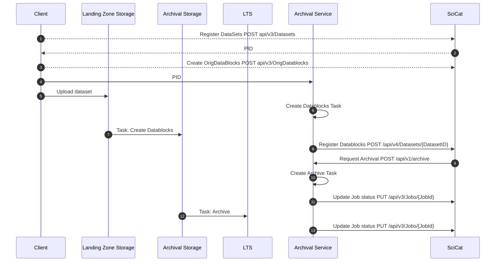

# Archiving Flow

## Data Flow

```mermaid
sequenceDiagram
  autonumber
  participant C as Client 
  participant L as Landing Zone Storage
  participant AS as Archival Storage
  participant LTS
  participant A as Archival Service
  participant S as SciCat 

  C-->>S: Register DataSets POST api/v3/Datasets
  S-->>C: PID
  C-->>S: Create OrigDataBlocks POST api/v3/OrigDatablocks
  C->>A: PID
  C->>L: Upload dataset
  A->>A: Create Datablocks Task
  L->>AS: Task: Create Datablocks
  A->>S: Register Datablocks POST /api/v4/Datasets/{DatasetID}
  S->>A: Request Archival POST /api/v1/archive
  A->>A: Create Archive Task
  A ->> S: Update Job status PUT /api/v3/Jobs/{JobId} 
  AS->>LTS: Task: Archive
  A ->> S: Update Job status PUT /api/v3/Jobs/{JobId}

```
