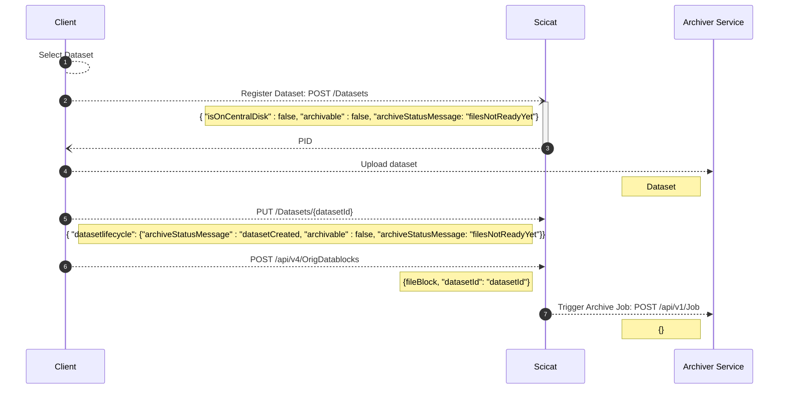
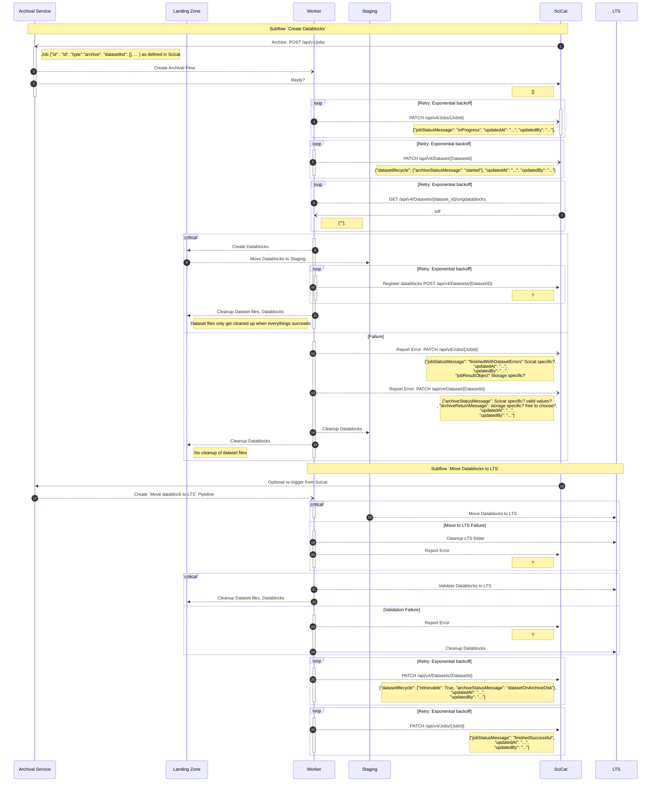
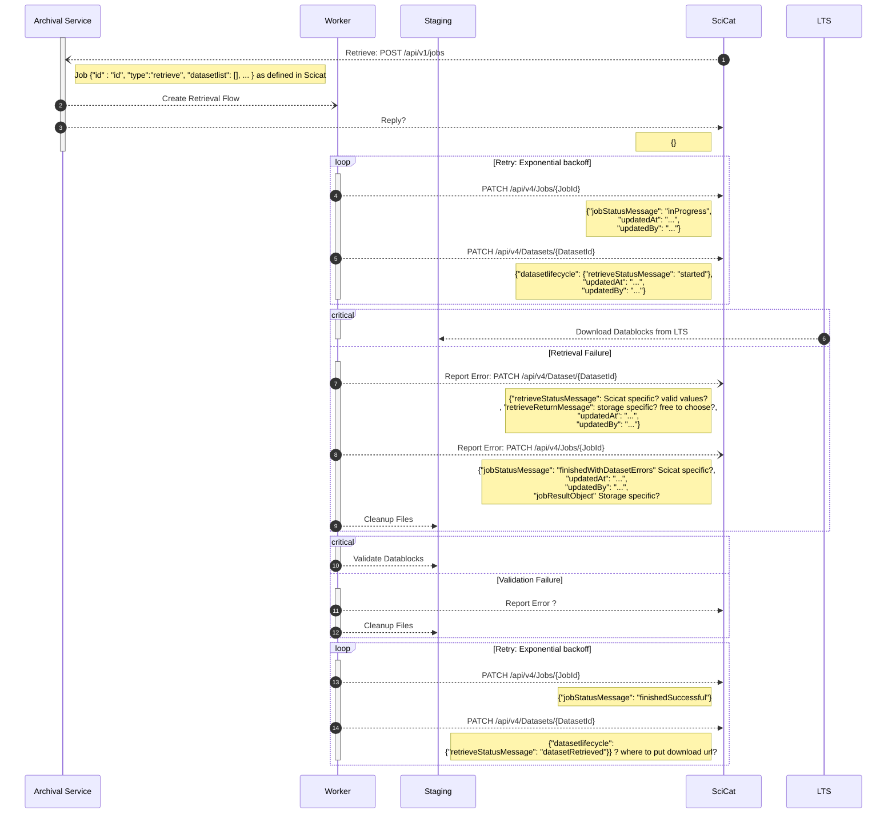

# Archiving Flow

## Upload flow

- Source folder never used: why?
- Datafile list vs origdatablocks?

## [Archival Task Flow](./flows/archiving_flow.py)

Archival is split into two subflows, `Create Datablocks` and  `Move Datablocks to LTS`. That can be triggered separately.

## [Retrieval Task Flow](./flows/retrieval_flow.py)

