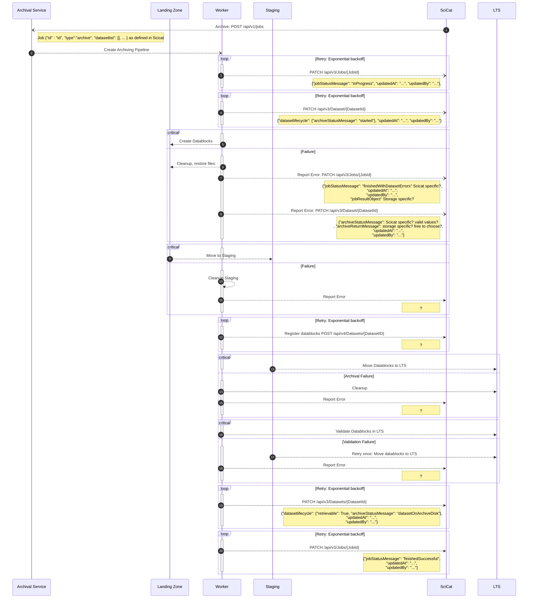
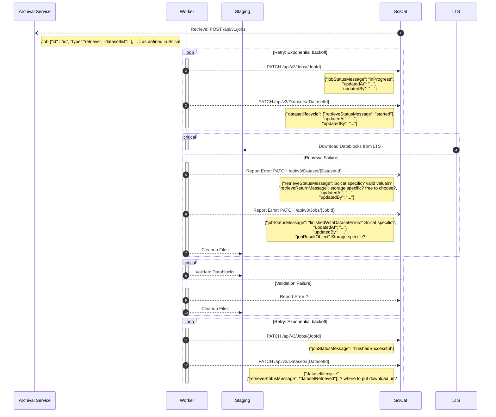

# Archiving Flow

## [Archival Task Chain](./flows/archiving_flow.py)

```mermaid
sequenceDiagram
  autonumber
  participant AS as Archival Service
  participant L as Landing Zone
  participant J as Worker
  participant A as Staging
  participant S as SciCat
  participant LTS as LTS

  S --) AS: Archive: POST /api/v1/jobs
  Note right of AS: Job {"id" : "id", "type":"archive", "datasetlist": [], ... } as defined in Scicat
  
   AS --) J: Create Archiving Pipeline
  loop Retry: Exponential backoff
    activate J
      J --) S: PATCH /api/v3/Jobs/{JobId}
      Note left of S: {"jobStatusMessage": "inProgress", "updatedAt": "...", "updatedBy": "..."}, 
    deactivate J
  end
  loop Retry: Exponential backoff
    activate J
      J --) S:  PATCH /api/v3/Dataset/{DatasetId}
      Note left of S: {"datasetlifecycle": {"archiveStatusMessage": "started"}, "updatedAt": "...", "updatedBy": "..."}  
    deactivate J
  end
  critical 
    activate J
      J -->> L:  Create Datablocks
    deactivate J
  option Failure
    activate J
      J -->> L: Cleanup, restore files
      J --) S: Report Error: PATCH /api/v3/Jobs/{JobId}
      Note left of S: {"jobStatusMessage": "finishedWithDatasetErrors" Scicat specific?,<br>  "updatedAt": "...",<br>  "updatedBy": "...", <br> "jobResultObject" Storage specific?
      J --) S: Report Error: PATCH /api/v3/Dataset/{DatasetId}
      Note left of S: {"archiveStatusMessage": Scicat specific? valid values?<br>, "archiveReturnMessage": storage specific? free to choose?, <br> "updatedAt": "...", <br> "updatedBy": "..."}
    deactivate J
  end
  critical
    activate J
    L -->> A: Move to Staging
    deactivate J
  option Failure
    activate J
    J -->> J: Cleanup Staging
    J -->> S: Report Error
    Note left of S: ?
    deactivate J
  end
  loop Retry: Exponential backoff
    activate J
    J -->> S: Register datablocks POST /api/v4/Datasets/{DatasetID}
    Note left of S: ?
    deactivate J
  end
  
  critical
    activate J
    A -->> LTS: Move Datablocks to LTS
    deactivate J
  option Archival Failure
    activate J
    J -->> LTS: Cleanup
    J -->> S: Report Error
    Note left of S: ?
    deactivate J
  end
  critical 
    activate J
    J -->> LTS:  Validate Datablocks in LTS
    deactivate J
  option Validation Failure
    activate J
    A -->> LTS: Retry once: Move datablocks to LTS
    J -->> S: Report Error
    Note left of S: ?
    deactivate J
  end
  loop Retry: Exponential backoff
    activate J
    J -->> S:  PATCH /api/v3/Datasets/{DatasetId}
    Note left of S: {"datasetlifecycle": {"retrievable": True, "archiveStatusMessage": "datasetOnArchiveDisk"}, <br> "updatedAt": "...", <br> "updatedBy": "..."} 
    deactivate J
  end 
  loop Retry: Exponential backoff
    activate J
    J -->> S: PATCH /api/v3/Jobs/{JobId}
    Note left of S: {"jobStatusMessage": "finishedSuccessful",<br>  "updatedAt": "...", <br> "updatedBy": "..."} 
    deactivate J
  end 
```

## Retrieval Task Chain

```mermaid
sequenceDiagram
  autonumber
  participant AS as Archival Service
  participant J as Worker
  participant R as Staging
  participant S as SciCat
  participant LTS as LTS

  S --) AS: Retrieve: POST /api/v1/jobs
  Note right of AS: Job {"id" : "id", "type":"retrieve", "datasetlist": [], ... } as defined in Scicat
  
  loop Retry: Exponential backoff
    activate J
      J -->> S: PATCH /api/v3/Jobs/{JobId}
      Note left of S: {"jobStatusMessage": "inProgress",<br> "updatedAt": "...", <br> "updatedBy": "..."}  
      J -->> S: PATCH /api/v3/Datasets/{DatasetId}
      Note left of S: {"datasetlifecycle": {"retrieveStatusMessage": "started"},<br> "updatedAt": "...", <br> "updatedBy": "..."}  
    deactivate J
  end
  critical
    activate J
      LTS -->> R: Download Datablocks from LTS
    deactivate J
  option Retrieval Failure
    activate J
      J --) S: Report Error: PATCH /api/v3/Dataset/{DatasetId}
          Note left of S: {"retrieveStatusMessage": Scicat specific? valid values?<br>, "retrieveReturnMessage": storage specific? free to choose?, <br> "updatedAt": "...", <br> "updatedBy": "..."}
      J --) S: Report Error: PATCH /api/v3/Jobs/{JobId}
         Note left of S: {"jobStatusMessage": "finishedWithDatasetErrors" Scicat specific?,<br>  "updatedAt": "...",<br>  "updatedBy": "...", <br> "jobResultObject" Storage specific?
      J -->> R: Cleanup Files
    deactivate J
  end
  critical
    activate J
    J -->> R: Validate Datablocks
    deactivate J
  option Validation Failure
    activate J
      J -->> S: Report Error ?
      J -->> R: Cleanup Files
    deactivate J
  end
  loop Retry: Exponential backoff
    activate J
      J -->> S: PATCH /api/v3/Jobs/{JobId}
      Note left of S: {"jobStatusMessage": "finishedSuccessful"} 
      J -->> S: PATCH /api/v3/Datasets/{DatasetId}
      Note left of S: {"datasetlifecycle":<br> {"retrieveStatusMessage": "datasetRetrieved"}} ? where to put download url? 
    deactivate J
  end 

```
