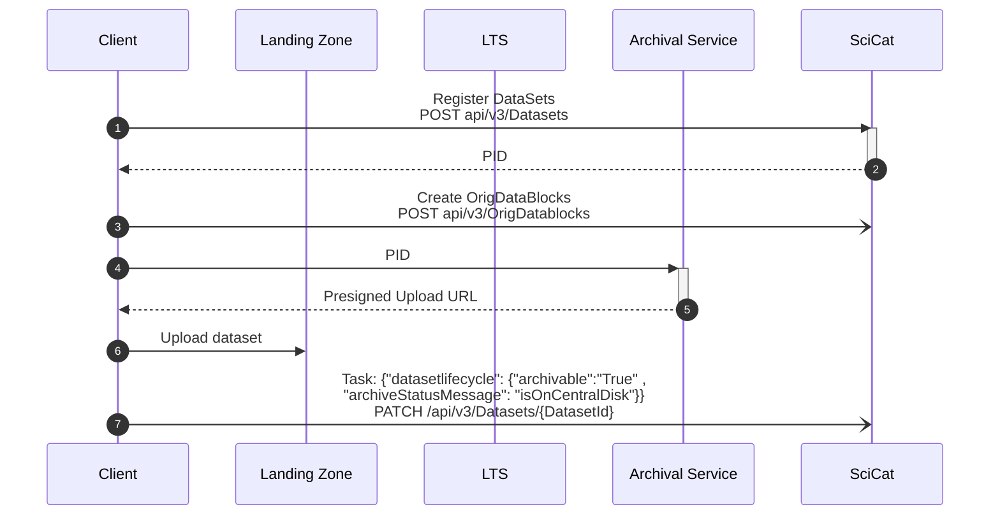
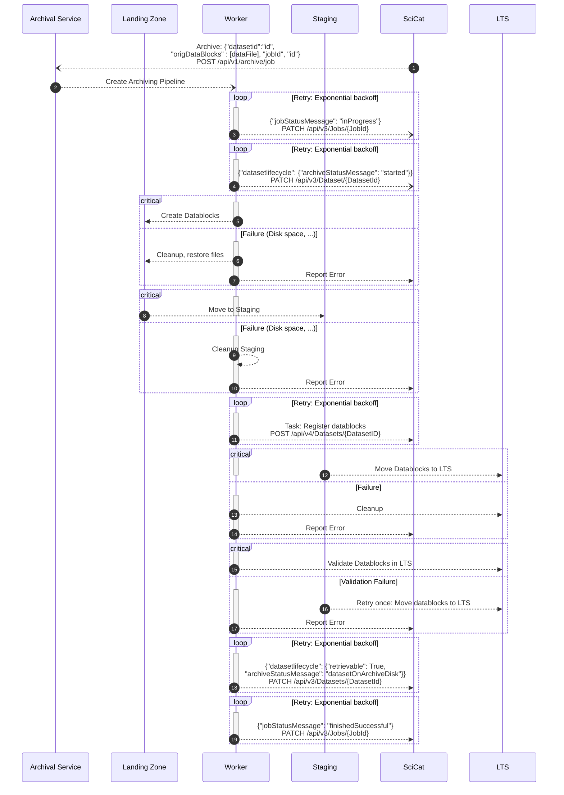
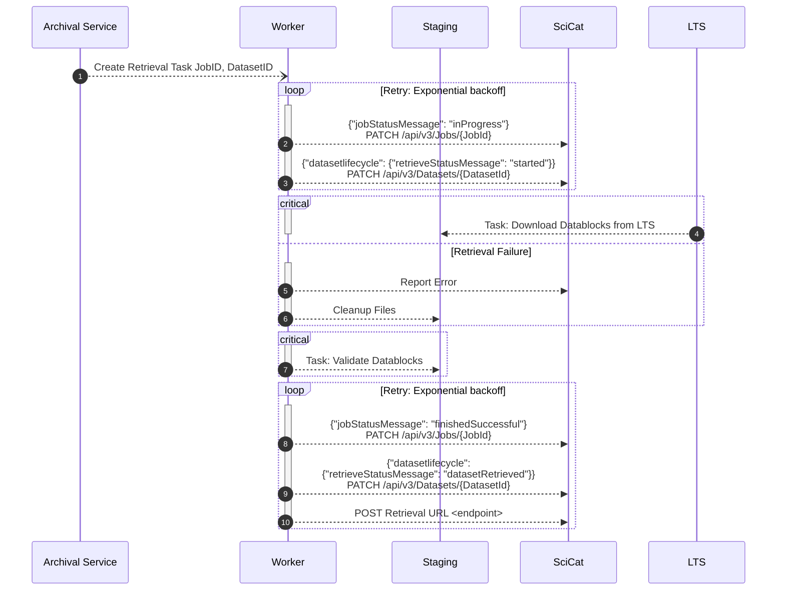

# Archiving Flow

### Upload Data Sequence

  <!-- A-)J: Create Datablocks Task
  activate J
  L->>AS: Task: Create Datablocks
  loop Retry: Exponential backoff
    J->>S: Register Datablocks POST /api/v4/Datasets/{DatasetID}
  end
  deactivate J
  loop Retry: Exponential backoff
    S->>A: Request Archival POST /api/v1/archive
  end
  A->>J: Create Archive Task
  activate J
  AS ->>LTS: Task: Archive
  loop Retry: Exponential backoff
    J ->> S: Update Job status PUT /api/v3/Jobs/{JobId} 
  end
  deactivate J -->

### [Archival Task Chain](./archival_tasks.py)

### Retrieval Task Chain

