# Architecture

## Component Diagram

### Components

#### Archiver Service

| Name                    | Technology                             | Description                                                      | Endpoint                                        |
|-------------------------|----------------------------------------|------------------------------------------------------------------|-------------------------------------------------|
| Reverse Proxy           | Traefik <https://traefik.io/traefik/>  | Routes traffic to endpoints                                      | <https://${HOST}/dashboard/>                    |
| Backend Api             | FastAPI <https://fastapi.tiangolo.com> | Endpoint for Scicat backend, requests flow scheduling by Prefect | <https://${HOST}/archiver/api/v1/docs>          |
| Workflow Orchestraction | Prefect <https://www.prefect.io>       | Orchestrates workflows for archival and retrieval operations     | <https://${HOST}/archiver/prefect/ui/dashboard> |

#### Workflow Orchestration

| Name           | Technology                                                            | Description | Endpoint                                        |
|----------------|-----------------------------------------------------------------------|-------------|-------------------------------------------------|
| Prefect Server | <https://docs.prefect.io/3.0/manage/self-host>                        |             | <https://${HOST}/archiver/prefect/ui/dashboard> |
| Prefect Worker | <https://docs.prefect.io/3.0/deploy/infrastructure-concepts/workers>  |             | n/a                                             |
| Prefect Flow   | <https://docs.prefect.io/3.0/develop/write-flows#write-and-run-flows> |             | n/a                                             |

#### Storage Components

| Name           | Technology             | Description                                                            | Endpoint                  |
|----------------|------------------------|------------------------------------------------------------------------|---------------------------|
| Storage Server | Minio <https://min.io> | Storage for datasets that are to be archived or are retrievable        | <http://localhost/minio/> |
| LTS Share      | NFS Network share      | ETHZ Long term storage where datasets are stored on and retrieved from | n/a                       |

#### External Components

| Name            | Technology                                       | Description                                                                             | Endpoint                                                                    |
|-----------------|--------------------------------------------------|-----------------------------------------------------------------------------------------|-----------------------------------------------------------------------------|
| Ingestor        | Golang <https://github.com/SwissOpenEM/Ingestor> | Client application to select, ingest, and upload datasets                               | n/a                                                                         |
| SciCat Frontend | Node.js <https://scicatproject.github.io>        | Data catalog frontend where datasets are registered and archival/retrieval is triggered | <https://discovery.psi.ch/>, <https://${HOST}/>                             |
| SciCat Backend  | Node.js <https://scicatproject.github.io>        | Data catalog backend where datasets are registered and archival/retrieval is triggered  | <https://dacat.psi.ch/explorer/>, <https://${HOST}/scicat/backend/explorer> |

## Authentication

Certain service pages do not support standard OAuth2/OIDC authentication mechanism, such as:

- Traefik dashboard
- MinIO admin login
- Grafana monitoring dashboard

To protect these pages, we use a proxy technology called **Forward Auth**. To achieve this, we need to configure the following:

- we need to tell Traefik to act as a **reverse proxy** to logically protect certain webpages
- we do this by registering a so called **middleware** in traefik
- this middleware will be of type [forwardauth](https://doc.traefik.io/traefik/middlewares/http/forwardauth/) and redirects to a service called **authentik-proxy**, e.g. `traefik.http.middlewares.authentik.forwardauth.address: http://authentik-proxy:9000/outpost.goauthentik.io/auth/traefik`
- `authentik-proxy` service integrates with Traefik's reverse proxy and acts as a **authentication gateway** to Authentik's **outpost**
- an outpost in Authentik is a deployment that acts as a bridge between Authentik and external services, handling authentication and authorization. 
- in Authentik (our identity broker) we need to register
  - **Application**: basically a name and a URL where the application can be found. It is onnected to one provider
  - **Provider**: the mechanism we use _how_ to provide authentication and _source of the users_. For our use-case, we take a **Proxy Provider** of type **Forward Auth** at domain level, as all the service pages should be protected the same way. A provider can be connected to many applications.
  - **Outpost**: an entity that talks to the Authentik-proxy service and provides a AUTHENTIK_TOKEN for that service. It is also connected to the provider. 
- for every service page that we would like to protect, we have to tell Traefik's router to use the `authentik` middleware defined earlier, e.g. `traefik.http.routers.dashboard.middlewares=authentik`

The following sequence diagram illustrates the authentication mechanism.

```mermaid

sequenceDiagram
  autonumber
  participant U as User Browser
  participant T as Traefik<br/>(reverse-proxy)
  participant S as Service Page
  participant O as authentik-proxy<br/>(outpost)
  participant AO as Authentik outpost
  participant AP as Authentik provider
  participant I as LDAP<br/>(identity provider)

  U -) T: request access to service page
  T -) T: is user authenticated (cookie 🔑)?
  T -) O: redirect to outpost
  O -) AO: redirect to authentication (AUTHENTIK_TOKEN 🔑)
  AO -) AP: redirect to login page
  AP -) U: ask for username
  U -) AP: enter username
  AP -) I: check username exists
  I -) AP: OK
  AP -) I: authorization: username is in allowed groups
  I -) AP: OK
  AP -) U: ask for password (plus OTP, if needed)
  U -) AP: enter password 🔑
  AP -) I: check password 🔑
  I -) AP: password OK
  AP -) O: redirect (cookie 🔑)
  O -) T: redirect (cookie 🔑)
  T -) S: access service page

  loop optional: sync users & groups
     AP -) I: get users, groups
     I -) AP: users, groups
  end

```

