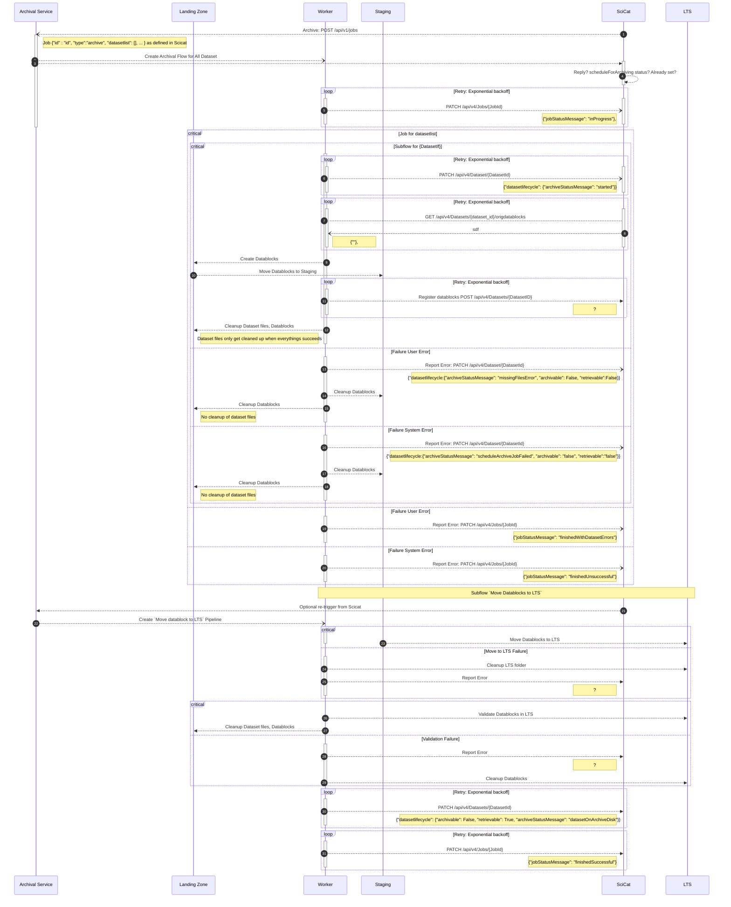

# [Archival Flow](../backend/archiver/flows/archive_datasets_flow.py)

Archival is split into two subflows, `Create Datablocks` and  `Move Datablocks to LTS`, which can be triggered separately. An archival task can contain multiple datasets; for simplicity the case with only one is depicted here.

| Identifier   | Description                                   |
| ------------ | --------------------------------------------- |
| Flow         | Sequence of tasks necessary for archiving     |
| Subflow      | Flow triggered by a parent flow               |
| Job          | Schedules flow for multiple datasets          |
| Archive Flow | Subflow that runs archiving for one dataset   |
| User Error   | Dataset is incomplete, not found, ...         |
| System Error | unrecoverable (transient) error in the system |

