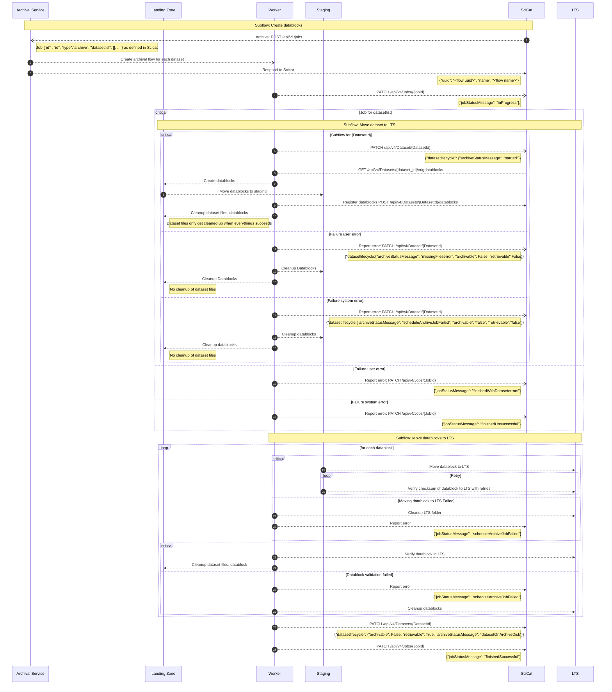
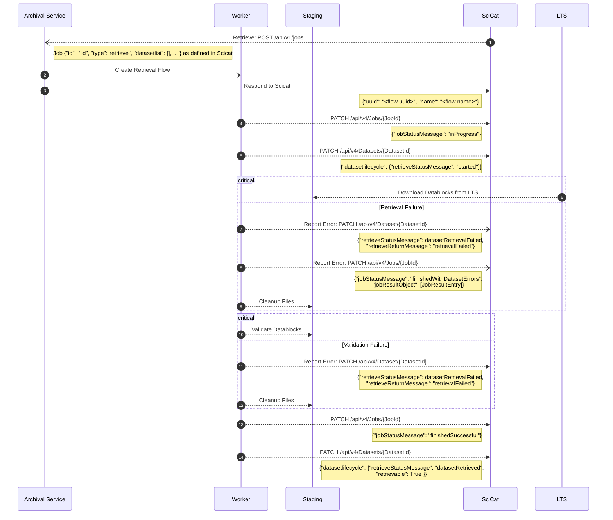

# Archival and Retrieval Flow

Archival is split into two subflows, `Create datablocks` and  `Move datablocks to LTS`An archival task can contain multiple datasets; for simplicity the case with only one is depicted here.

## Nomenclature

| Identifier   | Description                                                                                        |
|--------------|----------------------------------------------------------------------------------------------------|
| Flow         | Sequence of tasks and subflows                                                                     |
| Subflow      | Flow triggered by a parent flow                                                                    |
| Job          | A Scicat terminology corresponding to a archival flow; may contain multiple datasets as parameters |
| Archive Flow | Subflow that runs archiving for one dataset                                                        |
| User Error   | Scicat terminology for errors triggered by the user, e.g. dataset is incomplete; dataset not found |
| System Error | Scicat terminiolgy for unrecoverable (transient) error in the system                               |

## Critical Sections

A sequence of tasks that need to succeed atomically (all succeed or all are rolled back) are depicted as critical tasks below. They have a specific error handling associated in order to roll back all the task in that sequence.

## Retries

All task interacting with external services (i.e. Scicat) have retries implemented. Since they are not done in a task level but on the http request level, they are not depicted below.

Reading from the LTS has retries implemented on a task level and is therefore depicted below.

## Sequence Diagrams

### [Archival](../backend/archiver/flows/archive_datasets_flow.py)

The diagramm below shows the different steps in the archiving flow. Each step executed by the `Worker` is implemented as its own task (expect steps executed in error handling).



### [Retrieval](../backend/archiver/flows/retrieve_datasets_flow.py)

The diagramm below shows the different steps in the retrieval flow. Each step executed by the Worker is implemented as its own task (expect steps executed in error handling).



> Note: `updatedBy` and `updatedAt` are omitted for brevity but need to be set for every update of the job status and datsetlifecycle as well.

#### JobResult

The result of a retrieval job contains a list of `JobResultEntry` objects, which contain a url in order for end users to download the datablocks.

##### JobResultEntry

```json
 {
    "datasetId": "<datasetId>",
    "name": "str",
    "size": "str",
    "archiveId": "str",
    "url": "str"
 }
```
