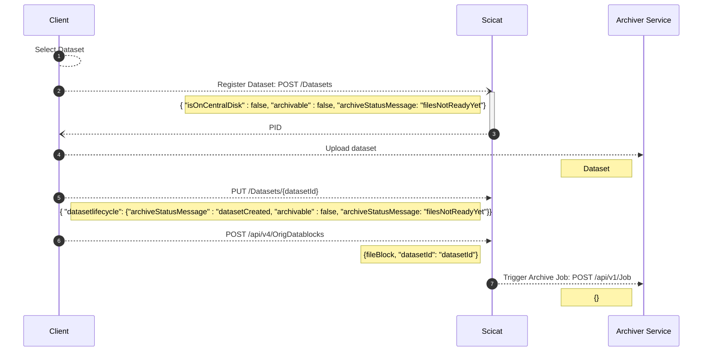
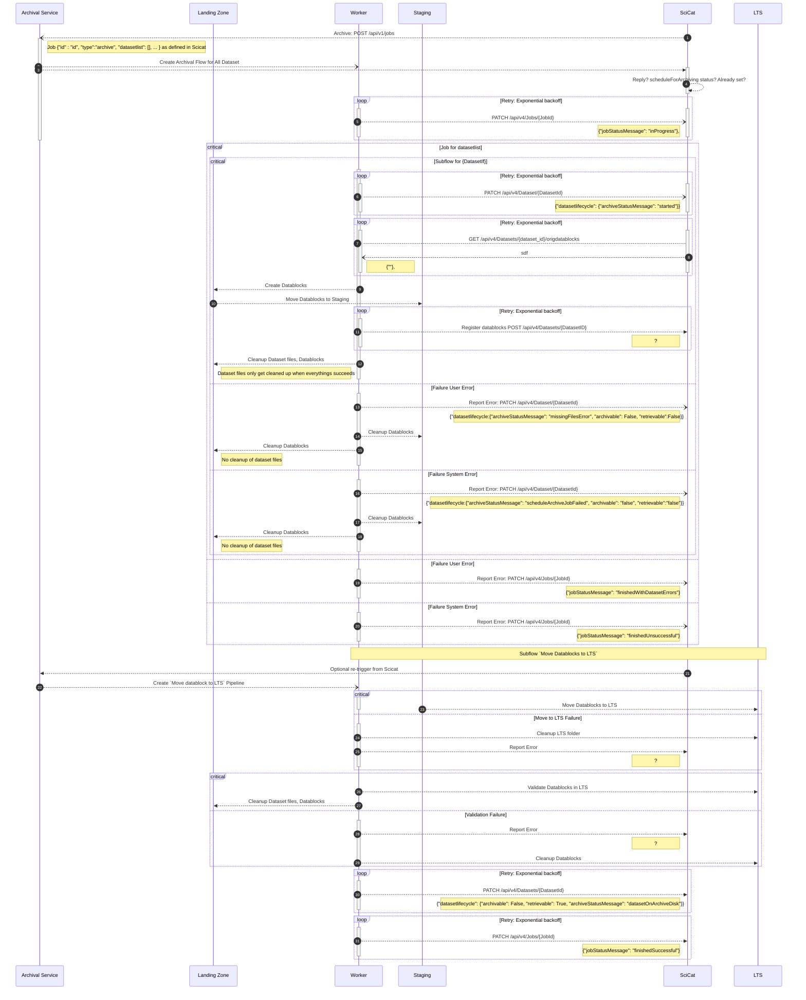
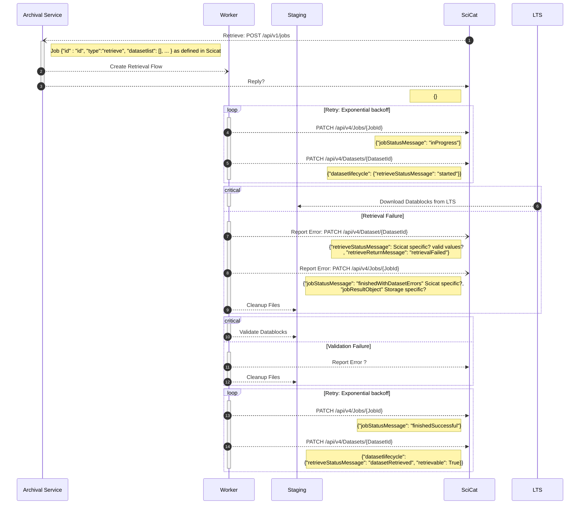
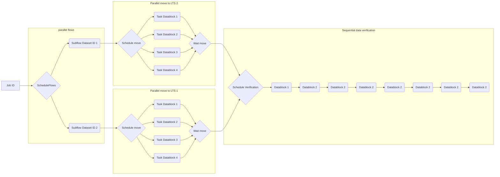

# Archiving Flow

## Upload flow

- Source folder never used: why?
- Datafile list vs origdatablocks?

## [Archival Task Flow](../backend/archiver/flows/archive_datasets_flow.py)

Archival is split into two subflows, `Create Datablocks` and  `Move Datablocks to LTS`, which can be triggered separately. An archival task can contain multiple datasets; for simplicity the case with only one is depicted here.

| Identifier   | Description                                   |
| ------------ | --------------------------------------------- |
| Flow         | Sequence of tasks necessary for archiving     |
| Subflow      | Flow triggered by a parent flow               |
| Job          | Schedules flow for multiple datasets          |
| Archive Flow | Subflow that runs archiving for one dataset   |
| User Error   | Dataset is incomplete, not found, ...         |
| System Error | unrecoverable (transient) error in the system |

## [Retrieval Task Flow](../backend/archiver/flows/retrieve_datasets_flow.py)

> Note: `updatedBy` and `updatedAt` are omitted for brevity but need to be set for every update of the job status and datsetlifecycle as well.

