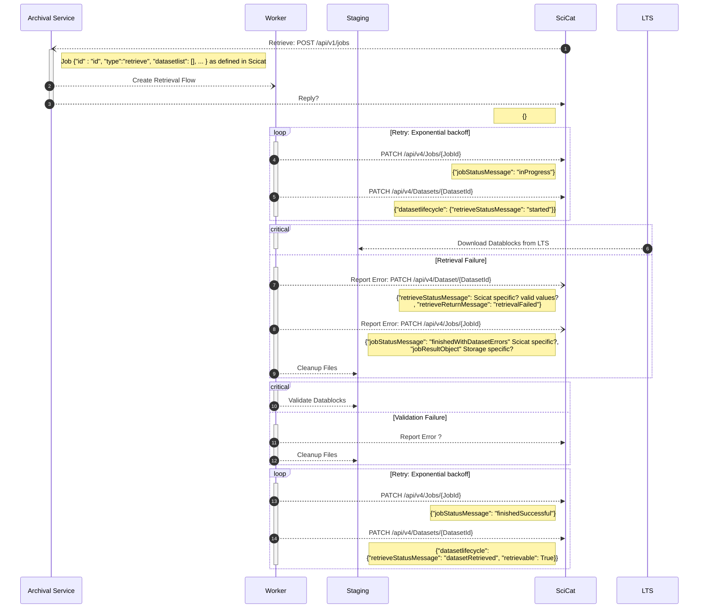
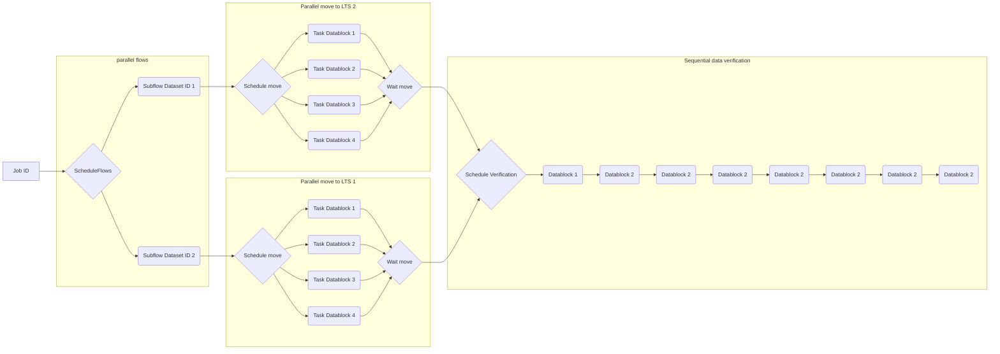

# [Retrieval Flow](../backend/archiver/flows/retrieve_datasets_flow.py)

> Note: `updatedBy` and `updatedAt` are omitted for brevity but need to be set for every update of the job status and datsetlifecycle as well.

- High level concepts
  - Flow
  - Task
  - error handling
  - storage (buckets, scratch, LTS) 
- Configuration
- Checksum Verification
- Concurrency
- interaction with LTS (timeouts, wait, wait for free storage)