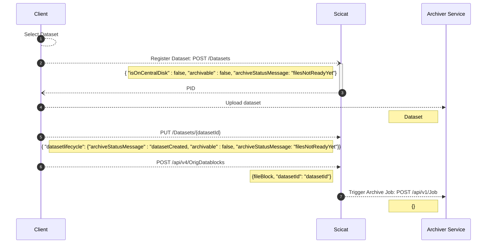

# Ingestion flow

```mermaid
sequenceDiagram
  autonumber
  participant C as Client
  participant S as Scicat
  participant A as Archiver Service

    C --> C: Select Dataset
    C --) S: Register Dataset: POST /Datasets
   activate S 
      Note left of S: { "isOnCentralDisk" : false, "archivable" : false, "archiveStatusMessage: "filesNotReadyYet"}
      S --) C: PID
   deactivate S
    C -->> A: Upload dataset
      Note left of A: Dataset
    C -->> S: PUT /Datasets/{datasetId}
      Note left of S: { "datasetlifecycle": {"archiveStatusMessage" : "datasetCreated, "archivable" : false, "archiveStatusMessage: "filesNotReadyYet"}}
    C -->> S: POST /api/v4/OrigDatablocks
      Note left of S: {fileBlock, "datasetId": "datasetId"}
    S -->> A: Trigger Archive Job: POST /api/v1/Job
      Note left of A: {}

```

- Source folder never used: why?
- Datafile list vs origdatablocks?

